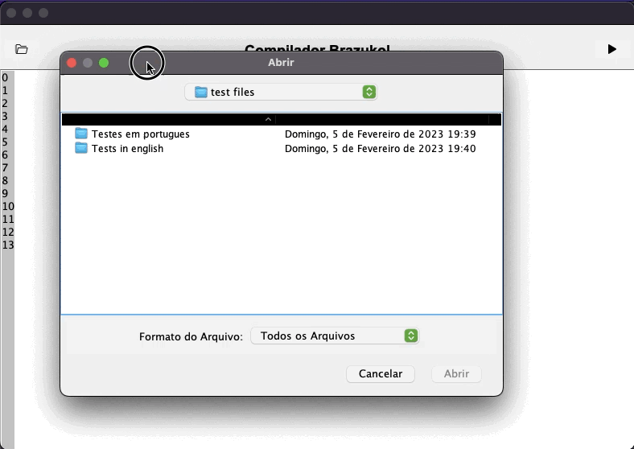

<h4 align="center">

  [Mudar para português](README_ptbr.md)

</h4>

<p align="center">
  <a href="https://img.shields.io/github/repo-size/Danilo-Js/Brazukol-Compiler/commits/master">
    
  </a>

  <a href="https://img.shields.io/github/issues/Danilo-Js/Brazukol-Compiler/issues">
    
  </a>
  
  
  
  
  
  
  
</p>

<h1 align="center">
   Brazukol Compiler :brazil:
</h1>

<p align="center" direction="row">
  <a href="#rocket-about-the-project">About the project</a>&nbsp;&nbsp;&nbsp;|&nbsp;&nbsp;&nbsp;
  <a href="#busts_in_silhouette-get-this-project">Get this project</a>&nbsp;&nbsp;&nbsp;|&nbsp;&nbsp;&nbsp;
  <a href="#memo-license">License</a>
</p>

</br>

<p align="center">
  
</p>

</br>

## :rocket: About the project
This repository is part of an academic work presented to the Compilers discipline, of the Computer Science course, taught by Professor Rodrigo Freitas Silva at the Federal University of Espírito Santo.

In this project, a simple IDE was made for the brazukol language, a language adapted from portugol.

### Lexical Analysis
The creation of tokens was done using the [JFlex](https://www.jflex.de/manual.html).

### Syntax Analisis
[BlocoSemFim](src/main/java/com/ufes/compilador/Syntatic/BlocoSemFim.java) - Checks for any block that has not been closed

[Nomeia_Programa](src/main/java/com/ufes/compilador/Syntatic/Nomeia_Programa.java) - Checks that the program was named correctly

[Sem_PontoVirgula](src/main/java/com/ufes/compilador/Syntatic/Sem_PontoVirgula.java) - Checks for missing ";" on some line

[VerificaProcedimento](src/main/java/com/ufes/compilador/Syntatic/VerificaProcedimento.java) - Checks if functions/procedures were declared correctly

## Semantic Analysis
[Break_Continue](src/main/java/com/ufes/compilador/Semantic/Break_Continue.java) - Checks for a "pare" (break) or "continua" (continue) without a "for" (pare) or "enquanto" (while)

[Indice_Vetor](src/main/java/com/ufes/compilador/Semantic/Indice_Vetor.java) - Checks that it is not accessing any existing indexes in an array

[ErroDeTipo](src/main/java/com/ufes/compilador/Semantic/ErroDeTipo.java) - Check that there are no type errors

[Escopo](src/main/java/com/ufes/compilador/Semantic/Escopo.java) - Checks that no variable is being declared more than once

## :busts_in_silhouette: Get this project

```bash
# Clone this repository
$ git clone https://github.com/Danilo-Js/Brazukol-Compiler.git
```

You can open the project in Netbeans, importing it as .zip, or you can open the compiler through [Brazukol.jar](Brazukol.jar)

## :memo: License
This project is [licensed by MIT](https://github.com/Danilo-Js/Brazukol-Compiler/blob/master/LICENSE).

---

#### Made by Danilo José Lima de Oliveira, Wesley Wernersbach Aranha, Bernardo Mangaraviti Carrerette, Maria Fernanda Mendes Moreira Mota and Matheus Eliziário Nardi.
