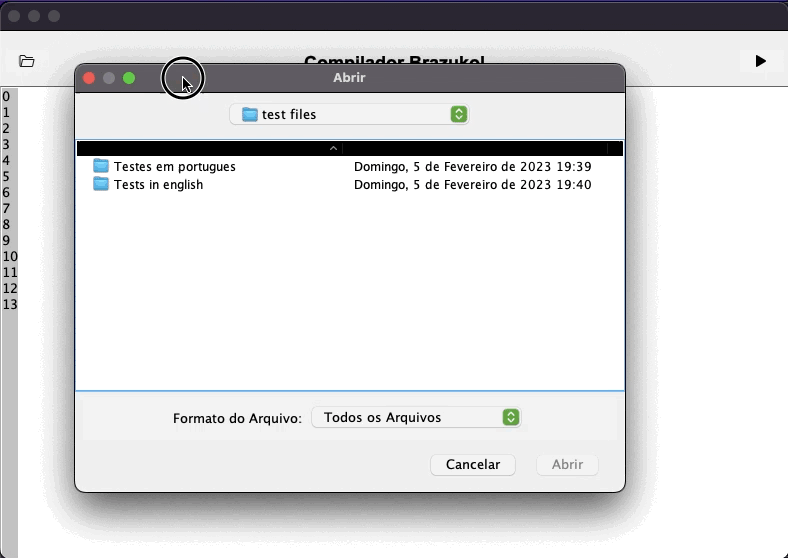

<h4 align="center">

  [Switch to english](https://github.com/Danilo-Js/Brazukol-Compiler)

</h4>

<p align="center">
  <a href="https://img.shields.io/github/repo-size/Danilo-Js/Brazukol-Compiler/commits/master">
    
  </a>

  <a href="https://img.shields.io/github/issues/Danilo-Js/Brazukol-Compiler/issues">
    
  </a>
  
  
  
  
  
  
  
</p>

<h1 align="center">
   Compilador Brazukol :brazil:
</h1>

<p align="center" direction="row">
  <a href="#rocket-sobre-o-projeto">Sobre o projeto</a>&nbsp;&nbsp;&nbsp;|&nbsp;&nbsp;&nbsp;
  <a href="#busts_in_silhouette-baixe-este-projeto">Baixe este projeto</a>&nbsp;&nbsp;&nbsp;|&nbsp;&nbsp;&nbsp;
  <a href="#memo-licença">Licença</a>
</p>

</br>

<p align="center">
  
</p>

</br>

## :rocket: Sobre o projeto
Este repositório faz parte de um trabalho acadêmico apresentado à disciplina Compiladores, do curso de Ciência da computação, ministrada pelo professor Rodrigo Freitas Silva na Universidade Federal do Espírito Santo.

Neste trabalho foi feita uma IDE simples para a linguagem brazukol, uma linguagem adaptada do portugol.

### Análise léxica
A criação dos tokens foram feitas com o uso do [JFlex](https://www.jflex.de/manual.html).

### Análise sintática
[BlocoSemFim](src/main/java/com/ufes/compilador/Syntatic/BlocoSemFim.java) - Verifica há algum bloco que não foi fechado 

[Nomeia_Programa](src/main/java/com/ufes/compilador/Syntatic/Nomeia_Programa.java) - Verifica se o programa foi nomeado corretamente

[Sem_PontoVirgula](src/main/java/com/ufes/compilador/Syntatic/Sem_PontoVirgula.java) - Verifica se faltou o ";" em alguma linha

[VerificaProcedimento](src/main/java/com/ufes/compilador/Syntatic/VerificaProcedimento.java) - Verifica se as funções/procedimentos foram declarados corretamente

## Análise semântica
[Break_Continue](src/main/java/com/ufes/compilador/Semantic/Break_Continue.java) - Verifica se há um "pare" (break) ou "continua" (continue) sem um "para" (for) ou "while" (enquanto)

[Indice_Vetor](src/main/java/com/ufes/compilador/Semantic/Indice_Vetor.java) - Verifica se não está acessando nenhum índice existente em um vetor

[ErroDeTipo](src/main/java/com/ufes/compilador/Semantic/ErroDeTipo.java) - Verifica se não há erros de tipagem

[Escopo](src/main/java/com/ufes/compilador/Semantic/Escopo.java) - Verifica se não há nenhuma variável sendo declarada mais de uma vez

## :busts_in_silhouette: Baixe este projeto

```bash
# Clone o repositório
$ git clone https://github.com/Danilo-Js/Brazukol-Compiler.git
```

Você pode abrir o projeto no Netbeans, o importando como .zip, ou pode abrir o compilador através do [Brazukol.jar](Brazukol.jar)


## :memo: Licença
Este projeto está com a licença MIT. [Clique aqui](https://github.com/Danilo-Js/Brazukol-Compiler/blob/master/LICENSE) para vê-la.

---

#### Feito por Danilo José Lima de Oliveira, Wesley Wernersbach Aranha, Bernardo Mangaraviti Carrerette, Maria Fernanda Mendes Moreira Mota e Matheus Eliziário Nardi.
